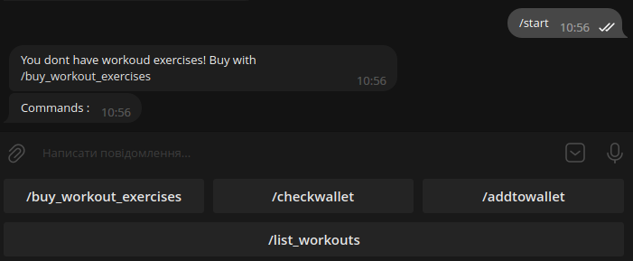
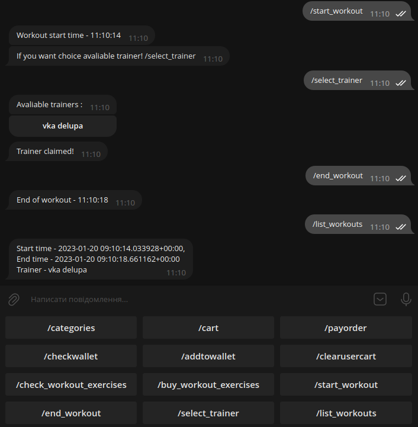

# Academy Django Course

Different django apps, with different tasks

**Tested on arch linux with python 3.10.9**

# Main django apps

* **product_db**
* **customize**
* **gym**

# product_db

Implementation of a product store in the form of a telegram bot

* Ability to add product with category
* User cart with order price
* Ability to pay order

# gym

Implementation of a gym in the form of a telegram bot, 
with functions from **product_db**

* Functional from **product_db**
* Exercises system, with checking of value
* Ability to start and end a workout
* Ability to check previous workouts
* Ability to choose an available coach
* Usable through the admin panel

**Start bot menu**

  

**Start and end exercise, with selecting trainer and 
list of workouts**

  

# customize

Working with views.py and admin.py, realization of getting data from file
and loading them into the database
